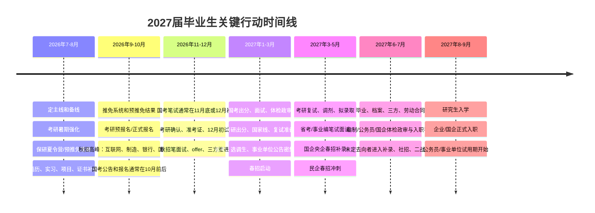

# 2027届毕业生升学 / 考编 / 就业 / 国央企上岸路线图

> 面向 2027 届毕业生的可视化时间线：把考研保研、考公选调、事业编、国企央企、普通就业放到同一张图里，帮助你判断什么时候准备、适合什么人、怎么备考，以及最终可能通向什么结果。

## 总览

截至 **2026 年 7 月 12 日**，很多 2027 届具体公告尚未发布，因此下面的月份按近年常见节奏规划。实际日期请以官方公告为准。

推荐策略：

| 策略 | 含义 |
| --- | --- |
| 一主 | 选择一条主路线，投入约 70% 时间 |
| 两备 | 保留两条备选路线，各投入约 15% 时间 |
| 不建议 | 考研、考公、事业编、国企、就业全部平均用力 |

## 关键时间线

## 五条路线怎么选

| 路线 | 适合人群 | 怎么准备 | 结果和前景 |
| --- | --- | --- | --- |
| 升学：考研 / 保研 / 留学 | 绩点较好、专业基础扎实、想提升学历平台，或本科专业/城市平台对就业不够友好的人 | 暑期强化；9-10 月报名；12 月初试；2027 年 3-4 月复试调剂。保研重点是绩点、科研、竞赛、英语和面试 | 2027 年 9 月入学。学历和平台提升明显，但会延迟就业，读研后仍需面对竞争 |
| 考公 / 选调生 | 追求稳定、能接受体制内节奏、文字表达和规则意识较强的人。党员、学生干部、奖学金、基层经历有优势 | 行测练速度，申论练概括和文章结构；10 月前后看国考职位表；11-12 月笔试；次年 1-3 月面试 | 行政编制，稳定性强。竞争激烈，岗位选择比盲目刷题更关键 |
| 事业编 | 想稳定但不一定非公务员的人。师范、医学、财会、计算机、中文、法学、管理类都有机会 | 关注省人社厅、人事考试网、学校医院官网；按岗位准备职测、综应、公基、专业课、试讲或结构化面试 | 可能是事业编、备案制、员额制或合同制，必须看清公告里的编制性质和服务期 |
| 国企央企 | 想兼顾稳定、平台和发展的人。电气、能源、机械、土木、通信、计算机、财会、法务、中文等专业机会较多 | 8-10 月冲秋招，3-5 月冲春招补录；关注国资委央企招聘平台、企业官网、学校就业网 | 多数是劳动合同制，不等于公务员编制。能源电力、通信、先进制造、军工、交通、金融科技更有长期空间 |
| 普通就业 / 民企 / 外企 | 想更快积累经验、追求薪资成长、能接受市场波动的人 | 7-8 月打磨简历和作品集；9-11 月秋招；2-4 月春招。项目、实习、作品、数据结果要和岗位关键词匹配 | 拿 offer 签三方或劳动合同。成长快、选择多，但稳定性弱于体制和国央企 |

## 路线对比矩阵

| 路线 | 核心窗口 | 最大优势 | 主要风险 | 最该盯的指标 |
| --- | --- | --- | --- | --- |
| 升学 | 2026 年 7 月 - 2027 年 4 月 | 学历和平台提升 | 延迟就业，复试/调剂不确定 | 目标院校匹配度、初试分数、复试材料 |
| 考公/选调 | 2026 年 10 月 - 2027 年 5 月 | 行政编制和稳定性 | 岗位竞争大，容错率低 | 职位表限制条件、行测速度、申论稳定分 |
| 事业编 | 2027 年 1 月 - 6 月 | 稳定岗位多，地区选择广 | 编制性质差异大 | 公告性质、专业匹配、笔面试比例 |
| 国企央企 | 2026 年 8 月 - 12 月，2027 年 3 月 - 5 月 | 平台稳定，行业资源强 | 不同子公司差异大 | 企业层级、岗位城市、培养机制、薪酬结构 |
| 普通就业 | 2026 年 9 月 - 11 月，2027 年 2 月 - 4 月 | 选择多、成长快 | 市场波动和淘汰压力 | 实习项目、作品集、岗位匹配度、面试转化率 |

## 推荐组合

| 类型 | 主线 | 备线 | 适合情况 |
| --- | --- | --- | --- |
| 稳妥型 | 国企央企 | 事业编 + 春招就业 | 想要稳定，但不想只押注考试 |
| 学历提升型 | 考研/保研 | 秋招 + 国企央企 | 希望提升学历平台，但需要保留就业兜底 |
| 体制型 | 国考/省考/选调 | 事业编 + 国企央企 | 明确追求体制内稳定 |
| 高成长型 | 企业就业 | 国企央企 + 考研 | 更看重行业经验、薪资成长和城市机会 |

## 现在就该做的事

- [ ] 在两周内确定主线，不要长期摇摆。
- [ ] 做一份一页版标准简历，同时适配企业、国企、实习投递。
- [ ] 建立公告清单：研招网、国家公务员局、省人社厅、国资委央企招聘平台、学校就业网。
- [ ] 每周量化复盘：投递数、笔试正确率、面试反馈、学习进度。
- [ ] 保留至少一条就业备线，避免考研或考编结果出来后没有退路。

## 官方入口

| 类型 | 入口 |
| --- | --- |
| 考研 / 推免 | [中国研究生招生信息网](https://yz.chsi.com.cn/) |
| 国考 | [国家公务员局考试录用专题](https://bm.scs.gov.cn/) |
| 国企央企 | [国务院国资委央企招聘平台](https://job.sasac.gov.cn/) |
| 事业编 / 省考 | 各省人社厅、各省人事考试网 |
| 校招 | 学校就业信息网、企业官网、企业官方公众号 |

## 一句话结论

2027 届最现实的打法不是“什么都试一点”，而是 **一主两备**：主线投入足够深，备线保留基本盘，这样既有冲刺空间，也有兜底结果。
