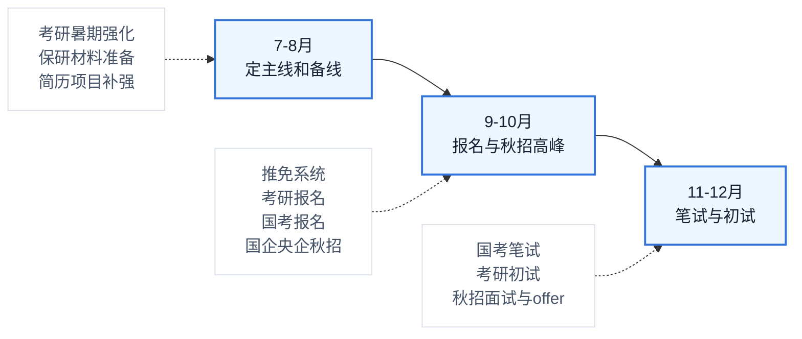
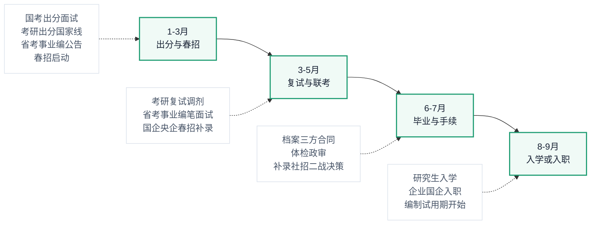

# 2027届毕业生升学 / 考编 / 就业 / 国央企上岸路线图

> 面向 2027 届毕业生的可视化时间线：把考研保研、考公选调、事业编、国企央企、普通就业放到同一张图里，帮助你判断什么时候准备、适合什么人、怎么备考，以及最终可能通向什么结果。


## 目录

- [总览](#总览)
- [关键时间线](#关键时间线)
  - [2026 下半年：定方向 + 抢秋招 + 参加关键考试](#2026-下半年定方向--抢秋招--参加关键考试)
  - [2027 上半年：出结果 + 补录 + 入学入职](#2027-上半年出结果--补录--入学入职)
  - [时间线动作表](#时间线动作表)
- [五条路线怎么选](#五条路线怎么选)
- [路线对比矩阵](#路线对比矩阵)
- [推荐组合](#推荐组合)
- [现在就该做的事](#现在就该做的事)
- [示例：如果我的主线是就业](#示例如果我的主线是就业)
  - [1. 两周内确定主线](#1-两周内确定主线)
  - [2. 一页版标准简历怎么写](#2-一页版标准简历怎么写)
  - [3. 公告清单怎么写](#3-公告清单怎么写)
  - [4. 每周量化复盘怎么写](#4-每周量化复盘怎么写)
  - [5. 保留就业备线](#5-保留就业备线)
- [官方入口](#官方入口)
- [一句话结论](#一句话结论)

## 总览

截至 **2026 年 7 月 12 日**，很多 2027 届具体公告尚未发布，因此下面的月份按近年常见节奏规划。实际日期请以官方公告为准。

推荐策略：

| 策略 | 含义 |
| --- | --- |
| 一主 | 选择一条主路线，投入约 70% 时间 |
| 两备 | 保留两条备选路线，各投入约 15% 时间 |
| 不建议 | 考研、考公、事业编、国企、就业全部平均用力 |

## 关键时间线

> GitHub 的 Mermaid `timeline` 在中文长文本较多时容易挤在一起，所以这里拆成 **2026 下半年** 和 **2027 上半年到入学/入职** 两张流程图。节点只放短标题，详细动作放在图后的表格里。

### 2026 下半年：定方向 + 抢秋招 + 参加关键考试



### 2027 上半年：出结果 + 补录 + 入学入职



### 时间线动作表

| 时间 | 关键词 | 具体动作 |
| --- | --- | --- |
| 2026 年 7-8 月 | 定方向 | 确定“一主两备”；考研暑期强化；保研夏令营/预推免；补简历、实习、项目、证书 |
| 2026 年 9-10 月 | 报名与秋招 | 推免系统和预推免结果；考研预报名/正式报名；秋招高峰；国考公告和报名通常在 10 月前后 |
| 2026 年 11-12 月 | 笔试与初试 | 国考笔试通常在 11 月底或 12 月初；考研确认、准考证、12 月初试；秋招面试、offer、三方推进 |
| 2027 年 1-3 月 | 出分与春招 | 国考出分、面试、体检政审；考研出分、国家线、复试准备；省考、选调生、事业单位公告密集出现；春招启动 |
| 2027 年 3-5 月 | 复试与补录 | 考研复试、调剂、拟录取；省考/事业编笔试面试；国企央企春招补录；民企春招冲刺 |
| 2027 年 6-7 月 | 毕业手续 | 毕业、档案、三方、劳动合同；编制/公务员/国企体检政审与入职手续；未定去向者进入补录、社招、二战决策 |
| 2027 年 8-9 月 | 入学入职 | 研究生入学；企业/国企正式入职；公务员/事业单位试用期开始 |
## 五条路线怎么选

| 路线 | 适合人群 | 怎么准备 | 结果和前景 |
| --- | --- | --- | --- |
| 升学：考研 / 保研 / 留学 | 绩点较好、专业基础扎实、想提升学历平台，或本科专业/城市平台对就业不够友好的人 | 暑期强化；9-10 月报名；12 月初试；2027 年 3-4 月复试调剂。保研重点是绩点、科研、竞赛、英语和面试 | 2027 年 9 月入学。学历和平台提升明显，但会延迟就业，读研后仍需面对竞争 |
| 考公 / 选调生 | 追求稳定、能接受体制内节奏、文字表达和规则意识较强的人。党员、学生干部、奖学金、基层经历有优势 | 行测练速度，申论练概括和文章结构；10 月前后看国考职位表；11-12 月笔试；次年 1-3 月面试 | 行政编制，稳定性强。竞争激烈，岗位选择比盲目刷题更关键 |
| 事业编 | 想稳定但不一定非公务员的人。师范、医学、财会、计算机、中文、法学、管理类都有机会 | 关注省人社厅、人事考试网、学校医院官网；按岗位准备职测、综应、公基、专业课、试讲或结构化面试 | 可能是事业编、备案制、员额制或合同制，必须看清公告里的编制性质和服务期 |
| 国企央企 | 想兼顾稳定、平台和发展的人。电气、能源、机械、土木、通信、计算机、财会、法务、中文等专业机会较多 | 8-10 月冲秋招，3-5 月冲春招补录；关注国资委央企招聘平台、企业官网、学校就业网 | 多数是劳动合同制，不等于公务员编制。能源电力、通信、先进制造、军工、交通、金融科技更有长期空间 |
| 普通就业 / 民企 / 外企 | 想更快积累经验、追求薪资成长、能接受市场波动的人 | 7-8 月打磨简历和作品集；9-11 月秋招；2-4 月春招。项目、实习、作品、数据结果要和岗位关键词匹配 | 拿 offer 签三方或劳动合同。成长快、选择多，但稳定性弱于体制和国央企 |

## 路线对比矩阵

| 路线 | 核心窗口 | 最大优势 | 主要风险 | 最该盯的指标 |
| --- | --- | --- | --- | --- |
| 升学 | 2026 年 7 月 - 2027 年 4 月 | 学历和平台提升 | 延迟就业，复试/调剂不确定 | 目标院校匹配度、初试分数、复试材料 |
| 考公/选调 | 2026 年 10 月 - 2027 年 5 月 | 行政编制和稳定性 | 岗位竞争大，容错率低 | 职位表限制条件、行测速度、申论稳定分 |
| 事业编 | 2027 年 1 月 - 6 月 | 稳定岗位多，地区选择广 | 编制性质差异大 | 公告性质、专业匹配、笔面试比例 |
| 国企央企 | 2026 年 8 月 - 12 月，2027 年 3 月 - 5 月 | 平台稳定，行业资源强 | 不同子公司差异大 | 企业层级、岗位城市、培养机制、薪酬结构 |
| 普通就业 | 2026 年 9 月 - 11 月，2027 年 2 月 - 4 月 | 选择多、成长快 | 市场波动和淘汰压力 | 实习项目、作品集、岗位匹配度、面试转化率 |

## 推荐组合

| 类型 | 主线 | 备线 | 适合情况 |
| --- | --- | --- | --- |
| 稳妥型 | 国企央企 | 事业编 + 春招就业 | 想要稳定，但不想只押注考试 |
| 学历提升型 | 考研/保研 | 秋招 + 国企央企 | 希望提升学历平台，但需要保留就业兜底 |
| 体制型 | 国考/省考/选调 | 事业编 + 国企央企 | 明确追求体制内稳定 |
| 高成长型 | 企业就业 | 国企央企 + 考研 | 更看重行业经验、薪资成长和城市机会 |

## 现在就该做的事

- [ ] 在两周内确定主线，不要长期摇摆。
- [ ] 做一份一页版标准简历，同时适配企业、国企、实习投递。
- [ ] 建立公告清单：研招网、国家公务员局、省人社厅、国资委央企招聘平台、学校就业网。
- [ ] 每周量化复盘：投递数、笔试正确率、面试反馈、学习进度。
- [ ] 保留至少一条就业备线，避免考研或考编结果出来后没有退路。

## 示例：如果我的主线是就业

假设目标是 **2027 届 Java 后端开发 / 企业信息化 / 国企数字化岗位**，主线选择就业，备线选择国企央企和事业单位信息技术岗。

### 1. 两周内确定主线

| 项目 | 示例填写 |
| --- | --- |
| 主线 | 就业：Java 后端开发、企业信息化、数字化岗位 |
| 备线 1 | 国企央企：运营商、电网、银行科技岗、制造业数字化岗 |
| 备线 2 | 事业单位：信息中心、数据管理、网络安全、软件开发岗 |
| 不再投入 | 暂不准备考研，除非 2026 年 9 月前就业准备明显失败 |
| 判断标准 | 9 月底前投递 50 个岗位，拿到 5 次以上笔试/面试机会；如果低于这个数，复盘简历和岗位匹配 |

### 2. 一页版标准简历怎么写

> 原则：一页纸、岗位关键词明确、经历用结果说话。企业版可以更强调技术和项目，国企版可以更强调成绩、证书、学生工作、稳定性和综合素质。

```text
姓名：张三
电话：138-0000-0000
邮箱：zhangsan@example.com
求职意向：Java 后端开发 / 企业信息化 / 数字化建设岗

教育背景
2023.09 - 2027.06    XX大学    软件工程    本科
GPA：3.6/4.0，专业前 20%
相关课程：Java 程序设计、数据库系统、计算机网络、操作系统、软件工程

核心技能
- Java：熟悉集合、异常、IO、多线程基础，了解 JVM 基础
- Spring Boot：能独立完成接口开发、参数校验、异常处理、日志和配置管理
- 数据库：熟悉 MySQL 表设计、索引、SQL 优化基础
- Redis：了解缓存、验证码、分布式锁、热点数据处理
- 工具：Git、Maven、Postman、Linux 基础命令

项目经历
校园二手交易平台    后端开发    2026.03 - 2026.06
- 使用 Spring Boot + MyBatis-Plus 完成用户、商品、订单、收藏模块
- 设计 8 张核心业务表，完成商品搜索、订单状态流转和用户发布管理
- 使用 Redis 缓存热门商品数据，降低重复查询，提升接口响应速度
- 编写接口文档和测试用例，使用 Postman 完成核心流程测试

实习 / 实践经历
XX科技有限公司    Java 开发实习生    2026.07 - 2026.09
- 参与内部管理系统需求开发，负责 3 个后台接口和 2 个数据查询页面
- 根据业务字段调整 SQL 查询逻辑，修复列表查询条件不准确问题
- 配合测试同学定位缺陷，完成缺陷记录、复现和回归验证

证书与荣誉
- 大学英语四级 / 六级：XXX 分
- 软件设计师 / 计算机二级 / 普通话 / 奖学金
- 校级优秀学生干部 / 三好学生 / 学科竞赛奖项

自我评价
- 有完整项目开发经历，熟悉从需求、建表、接口开发到测试联调的流程
- 学习稳定，执行力强，能接受国企央企和企业长期培养机制
```

### 3. 公告清单怎么写

| 平台 | 关注内容 | 检查频率 | 示例记录 |
| --- | --- | --- | --- |
| 学校就业信息网 | 校招宣讲、双选会、本校专属岗位 | 每周 3 次 | XX银行科技岗宣讲，9月20日网申截止 |
| 企业官网 | 互联网、制造业、软件公司校招 | 每周 2 次 | XX集团 2027 届秋招，Java 岗，投递中 |
| 国资委央企招聘平台 | 央企总部、子公司、地方分公司岗位 | 每周 2 次 | 中国XX集团数字化岗，要求计算机类、六级优先 |
| 国家电网/南方电网/运营商官网 | 电力、通信类国企校招 | 每周 2 次 | XX省公司信息通信岗，关注笔试时间 |
| 银行招聘官网 | 银行科技岗、金融科技岗、管培生 | 每周 2 次 | XX银行金融科技岗，网申已提交 |
| 省人社厅/人事考试网 | 事业单位信息技术岗、人才引进 | 每周 1 次 | XX市事业单位信息管理岗，待公告 |

### 4. 每周量化复盘怎么写

| 周期 | 投递数 | 笔试数 | 面试数 | 简历通过率 | 本周问题 | 下周动作 |
| --- | ---: | ---: | ---: | ---: | --- | --- |
| 2026.09.01 - 09.07 | 20 | 3 | 1 | 15% | 国企简历通过少，项目描述偏互联网 | 增加成绩、证书、学生工作和稳定性表述 |
| 2026.09.08 - 09.14 | 25 | 5 | 2 | 20% | Java 八股回答不稳，数据库索引薄弱 | 每天 30 分钟复盘面试题，补 MySQL 索引和事务 |
| 2026.09.15 - 09.21 | 18 | 4 | 3 | 22% | 项目亮点不够量化 | 把项目改成“做了什么、怎么做、结果怎样” |

### 5. 保留就业备线

| 备线 | 为什么保留 | 最低准备动作 |
| --- | --- | --- |
| 国企央企 | 稳定性强，和就业主线复用简历、笔试、面试准备 | 每周固定投递 5-8 个国企央企岗位 |
| 事业单位信息技术岗 | 和计算机专业匹配，部分岗位竞争小于三不限 | 每周查看省人社厅和人事考试网，积累公基/职测基础 |
| 春招补录 | 秋招失利后的最后一轮校园招聘窗口 | 2027 年 2 月前完成简历二次优化和面试复盘 |
## 官方入口

| 类型 | 入口 |
| --- | --- |
| 考研 / 推免 | [中国研究生招生信息网](https://yz.chsi.com.cn/) |
| 国考 | [国家公务员局考试录用专题](https://bm.scs.gov.cn/) |
| 国企央企 | [国务院国资委央企招聘平台](https://job.sasac.gov.cn/) |
| 事业编 / 省考 | 各省人社厅、各省人事考试网 |
| 校招 | 学校就业信息网、企业官网、企业官方公众号 |

## 一句话结论

2027 届最现实的打法不是“什么都试一点”，而是 **一主两备**：主线投入足够深，备线保留基本盘，这样既有冲刺空间，也有兜底结果。


